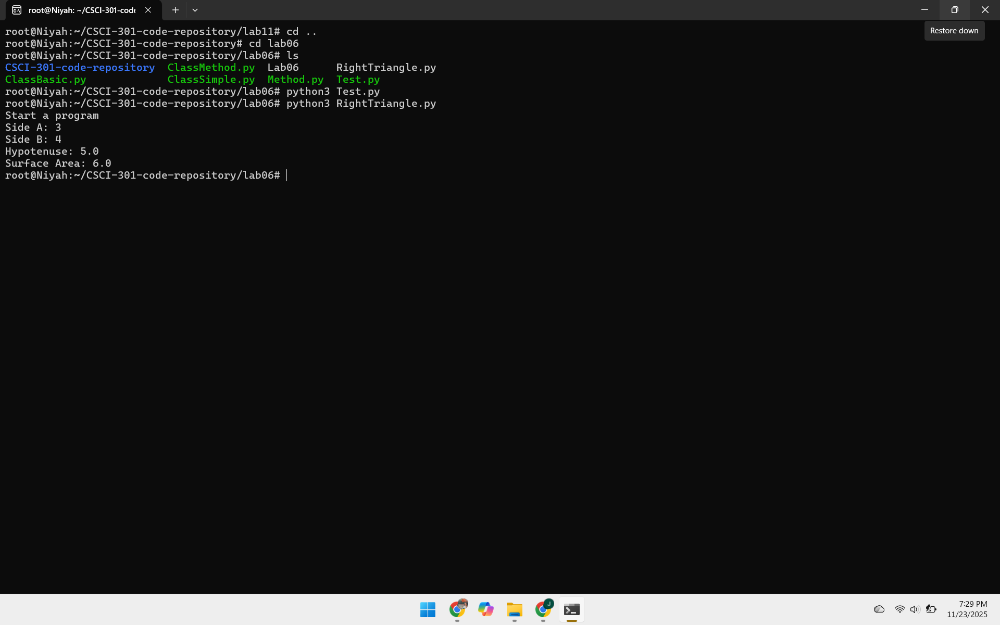
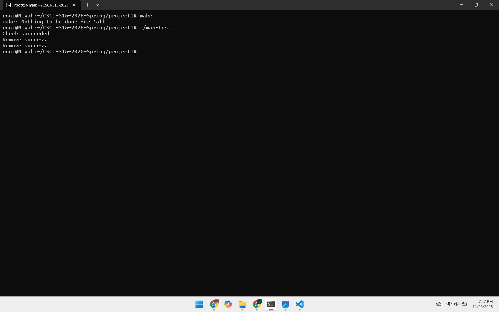
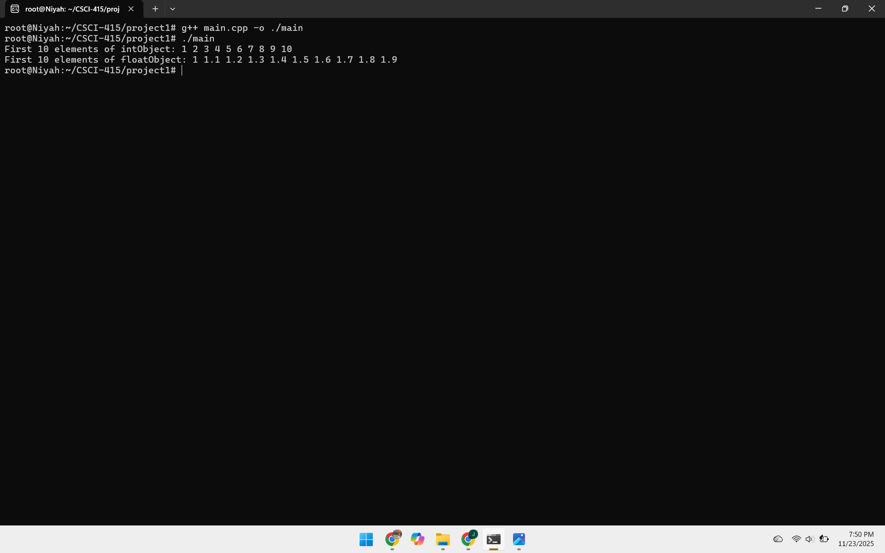
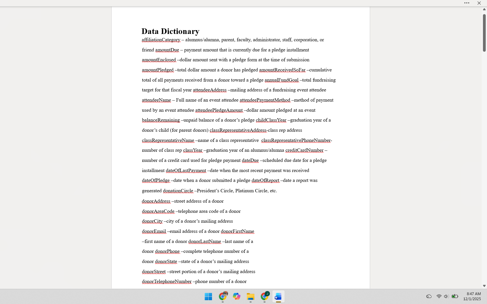

Portfolio
=========

Programming Projects
--------------------

*For access to my private project repositories, please [email me](mailto:jmcutchinbrown@student.csuniv.edu?subject=GitHub%20Access) with the subject line, GitHub Access.

---
### [Cross-Platform Disk Free Space Checker | CSCI 301](project1.md)

---
### [Sorted Student Map with Prefix Search | CSCI 315](project2.md)

---
### [Algorithms Assignment with Templates, Swaps, Copying, and Sorting | CSCI 415](project3.md)

---
### [Donor & Event Management Database Design (Data Dictionary & Cross-Reference Table) | CSCI 419](project4.md)

---

Ethics Papers
-------------

### [Ethics in Air Force Cyberspace Operations](/pdf/CSCI235_EthicsPaper_JaniyahCutchinBrown.pdf)

-   **Class: CSCI 235  
-   **Grade: A

### [The Ethics of Artificial Intelligence in the Air Force](/pdf/EthicsPaper_CSCI301_JaniyahCutchinBrown.pdf)

-   **Class: CSCI 301 
-   **Grade: A

### [The Ethics of Software Testing](/pdf/EthicsPaper_CSCI315_JaniyahCutchinBrown.pdf)

-   **Class: CSCI 315 
-   **Grade: A

---

Presentations
-------------

### [Presentation 1 Title](/pdf/sample_presentation.pdf)

- **Class:** 
- **Grade:**

### [Presentation 2 Title](/pdf/sample_presentation.pdf)

- **Class:** 
- **Grade:**

---

Page template forked from <a href="https://github.com/csu-cs/csci-portfolio">CSU-CS</a>

<!-- Remove above link if you don't want to attributive -->
