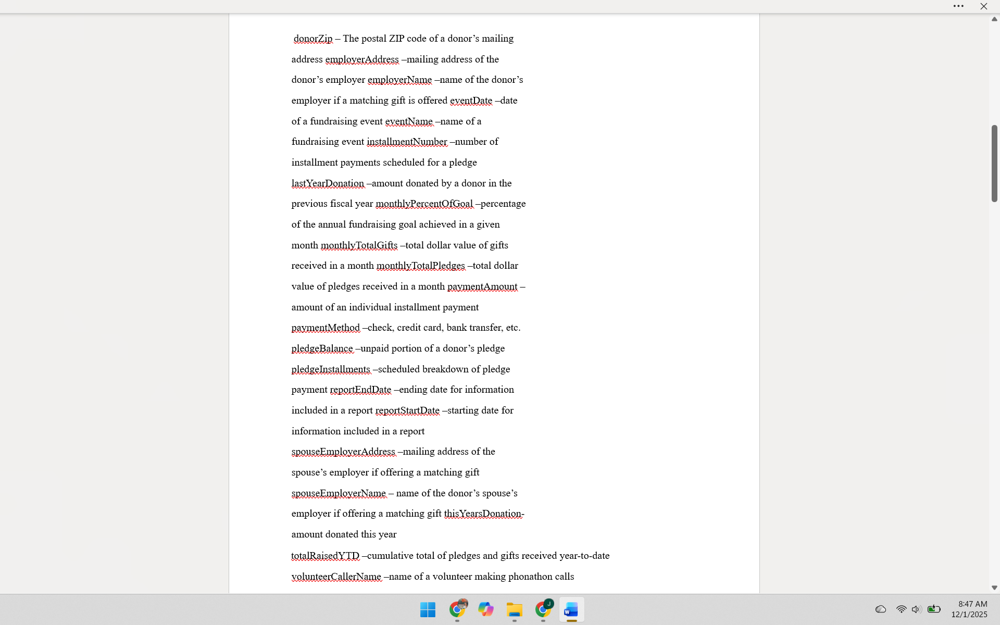
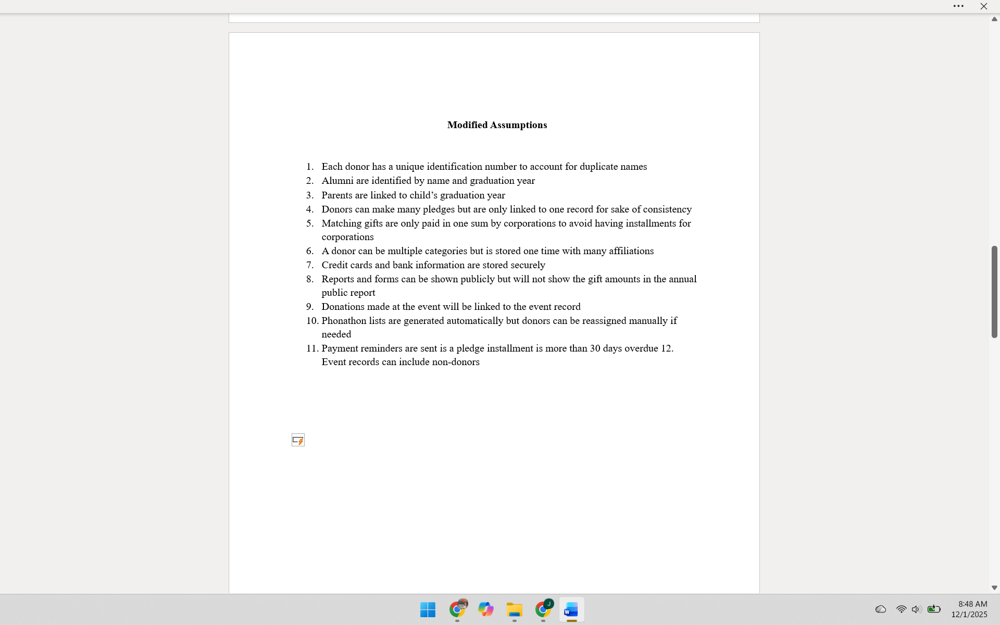
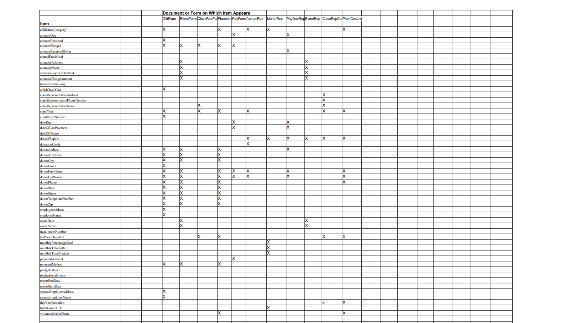
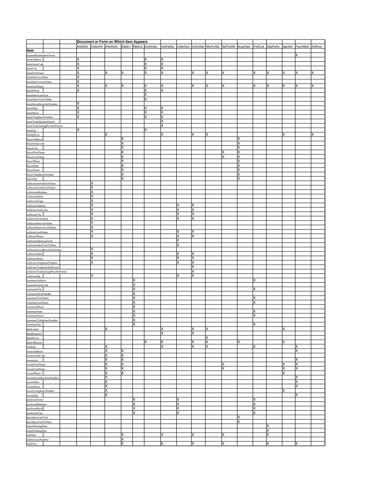
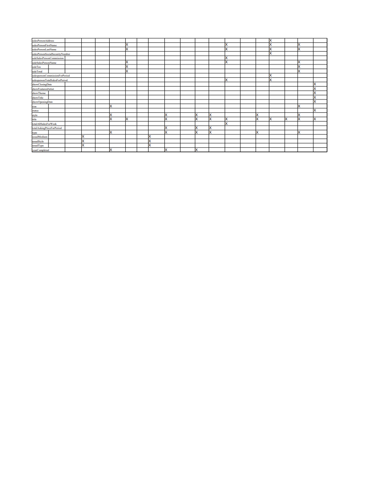

[Back to Portfolio](./)

Donor and Event Management Database Design (Data Dictionary & Cross Reference Table)
===============

-   **Class: CSCI 419
-   **Grade: N/A- Grade Archived
-   **Language(s): SQL
-   **Source Code Repository:** [features/mastering-markdown](https://guides.github.com/features/mastering-markdown/)  
    (Please [email me](mailto:example@csustudent.net?subject=GitHub%20Access) to request access.)

## Project description

This project involved creating comprehensive database documentatino for a Donor & Event Management System, including a detailed Data Dictionary and Cross Reference Table. These documents define the structure, constraints, and relationships of the database schema implemented in SQL.

The Data Dictionary lists each table's attributes, data types, keys, and detailed descriptions, while the Cross Reference Table maps relationships and foreign keys between entities to clarify their interconnections.

## UI Design

Data Dictionary: Precise definition of tables, columns, data types, and constraints ensuring clarity and consistency for development and maintenance.

Cross Reference Table: Visualizs and documents the relational connections between entities, supporting referential integrity and system navigation.

  
Fig 1. First Data Dictionary Page

 
Fig 2. Second Data Dictionary Page

 
Fig 3. Third Data Dictionary Page- Modified Assumptions

 
Fig 4. First Cross Reference Table Page 

 
Fig 5. Second Cross Reference Table Page 

 
Fig 6. Third Cross Reference Table Page 

For more details see [GitHub Flavored Markdown](https://guides.github.com/features/mastering-markdown/).

[Back to Portfolio](./)
